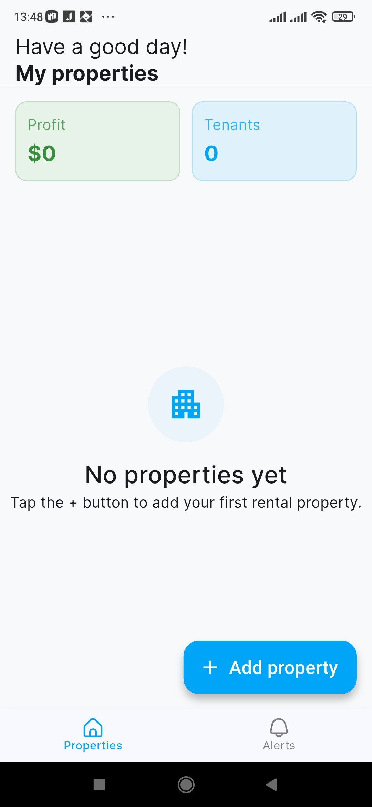
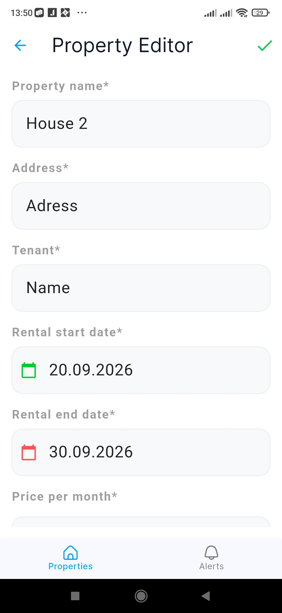
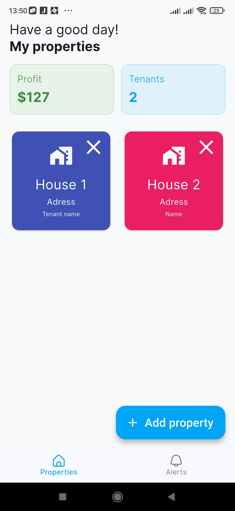

## 🏡 **Rental tracker "Logeria"**

🗓️ **Logeria is an open-source rental contract tracking system. The app is developed entirely in Dart and Flutter.**

## ✨ Features

* 📱 **Cross-Platform Performance**
* 🛡️ **100% Open-Source**
* 🔌 **Offline-First Architecture (SQLite)**
* ⏳ **Flexible Stay & Duration Control**
* 📈 **Time-Based Revenue Tracking**


## Getting Started

Follow these steps to run Logeria locally on your machine.

### Prerequisites

Before you begin, ensure you have the following installed:
* [Flutter SDK](https://flutter.dev) (Stable channel)
* [Dart SDK](https://dart.dev) (Included with Flutter)
* An IDE like VS Code, Android Studio, or IntelliJ IDEA

### Installation Steps

1. **Clone the repository:**
   ```bash
   git clone https://github.com
   cd logeria
   ```

2. **Get dependencies:**
   ```bash
   flutter pub get
   ```

3. **Generate code (Optional / for SQLite):**
   *If you are using Drift/Moor or build_runner for the SQLite database, run the compiler:*
   ```bash
   flutter pub run build_runner build --delete-conflicting-outputs
   ```

4. **Run the application:**
   ```bash
   flutter run
   ```


## Screenshots
<p align="center">
  
  
  
</p>

## 📄 License

This project is licensed under the GPL-3.0 License - see the [LICENSE](LICENSE) file for details.

[](https://gnu.org)

## 📬 Contact & Support

**📧 Email: sergeykovtun061@gmail.com**
